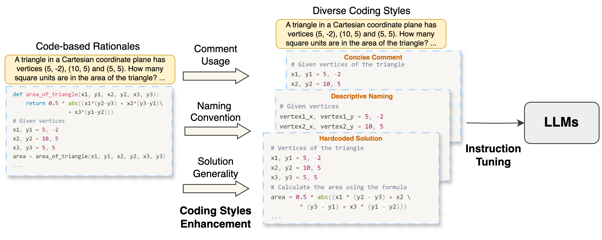

<h1 align="center"> CoinMath </h1>

<p align="center">
    <a href="https://arxiv.org/pdf/2412.11699v1" 
     target="_blank" 
     style="text-decoration: none; color: #0078d7; font-weight: bold; font-size: 18px;">
     ⚡ A repository for "CoinMath: Harnessing the Power of Coding Instruction for Math LLMs" ⚡
  </a>
</p>

📄[arXiv](https://arxiv.org/pdf/2412.11699v1)

🗂️[CoinMath Dataset](https://huggingface.co/datasets/amao0o0/CoinMath)

🧮 CoinMath Models:
[Llama-3.1-CoinMath-8B](https://huggingface.co/amao0o0/Llama-3.1-CoinMath-8B) | 
[CodeLlama-CoinMath-7B](https://huggingface.co/amao0o0/CodeLlama-CoinMath-7B)

Introduction: xxx



---
We adapt the implementation of [open-instruct](https://github.com/allenai/open-instruct) for instruction tuning and [MAmmoTH](https://github.com/TIGER-AI-Lab/MAmmoTH/tree/main) for evaluation.

## Installation
```
pip install --upgrade pip "setuptools<70.0.0" wheel 
# Note: Setuptools is temporarily pinned due to an issue with FlashAttention. 
# Once resolved, the version restriction can be removed.
pip install torch==2.4.0 torchvision==0.19.0 torchaudio==2.4.0 --index-url https://download.pytorch.org/whl/cu121
pip install packaging
pip install flash-attn==2.6.3 --no-build-isolation
pip install -r requirements.txt
python -m nltk.downloader punkt
pip install -e .
```
Alternatively, refer to [open-instruct](https://github.com/allenai/open-instruct) for additional installation options.

## Dataset Download
```
bash scripts/IF_data_download.sh
```
This process will generate three combinations of coding style data in the folder ```IF_data```:
- comment-descriptive-hardcoded.jsonl: Combines PoT rationales with comments, descriptive variable naming, and hardcoded solutions.
- noComment-obscure-general.jsonl: Combines PoT rationales with no comments, obscure variable naming, and generalized solutions.
- allTypes.jsonl: Includes a mixture of all coding style variants.

## Instruction Tuning
```
bash scripts/finetune_lora_with_accelerate.sh
```

## Evaluation
```
bash eval/run_eval.sh
```
The models' predictions and prediction accuracies are saved in ```eval/outputs-CoinMath``` and ```eval/results-CoinMath``` by default. 

To reproduce the results presented in the paper, we recommend installing the same package versions specified in MAmmoTH (eval/requirements.txt). Using different versions may lead to slight discrepancies.

## Citation
If you find our work useful, please cite our paper:
```
@article{wei2024coinmath,
  title={CoinMath: Harnessing the Power of Coding Instruction for Math LLMs},
  author={Wei, Chengwei and Wang, Bin and Kim, Jung-jae and Liu, Guimei and Chen, Nancy F},
  journal={arXiv preprint arXiv:2412.11699},
  year={2024}
}
```
Additionally, please cite [open-instruct](https://github.com/allenai/open-instruct) if you use the code for instruction tuning, and [MAmmoTH](https://github.com/TIGER-AI-Lab/MAmmoTH/tree/main) if you use the code for evaluation.